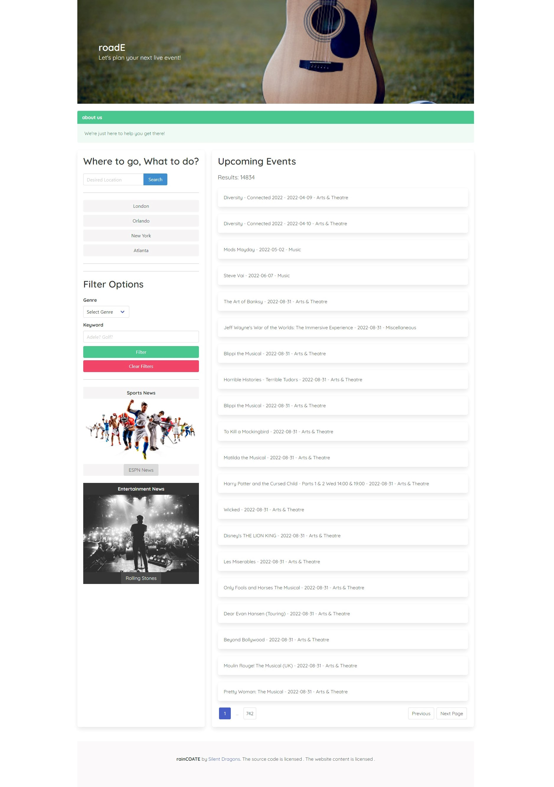

# roadE event planner project

## Lets plan your next event! 

With our app you can easily search for events that you would like to go to. 

roadE is a fully responsive webpage with user interactability. We allow you to search and filter for events by location, genre, and more!

To help keep track of your interests we have also implemented a search history of your last 8 searches, to quickly take you back to what you were looking for!

Once you have found an event that you're interested in, click on it to view more details in our modals, featuring the forecast for the day, an image of the event, dates and times for the event, and a URL where you can buy tickets if they are still available!

If you want to contact or follow us, click on the link on our page!

## Built With
* HTML
* CSS
* JavaScript
* Bulma
* Ticketmaster API
* Visual crossing API

## Preview

## Website
https://areed98.github.io/RoadE/

## Credits
* Made by Adrian Jimenez, Austin Reed, Gerald Harrison, and Brayden Mcmahan
* Military time to UTC converter: https://stackoverflow.com/questions/29206453/best-way-to-convert-military-time-to-standard-time-in-javascript

## License

MIT License

Copyright ©️ 2022 roadE

Permission is hereby granted, free of charge, to any person obtaining a copy
of this software and associated documentation files (the "Software"), to deal
in the Software without restriction, including without limitation the rights
to use, copy, modify, merge, publish, distribute, sublicense, and/or sell
copies of the Software, and to permit persons to whom the Software is
furnished to do so, subject to the following conditions:

The above copyright notice and this permission notice shall be included in all
copies or substantial portions of the Software.

THE SOFTWARE IS PROVIDED "AS IS", WITHOUT WARRANTY OF ANY KIND, EXPRESS OR
IMPLIED, INCLUDING BUT NOT LIMITED TO THE WARRANTIES OF MERCHANTABILITY,
FITNESS FOR A PARTICULAR PURPOSE AND NONINFRINGEMENT. IN NO EVENT SHALL THE
AUTHORS OR COPYRIGHT HOLDERS BE LIABLE FOR ANY CLAIM, DAMAGES OR OTHER
LIABILITY, WHETHER IN AN ACTION OF CONTRACT, TORT OR OTHERWISE, ARISING FROM,
OUT OF OR IN CONNECTION WITH THE SOFTWARE OR THE USE OR OTHER DEALINGS IN THE
SOFTWARE.

